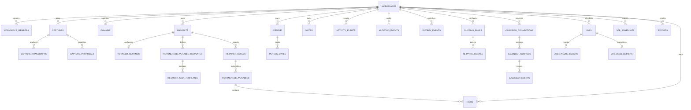

# Core beta schema

SLIP-009 establishes the relational source of truth used by Slipwell's beta.
The complete, executable definition is the versioned SQL in
`supabase/migrations/`; this document is a maintained map, not a second schema
source.

## Relationship map

All user-owned records carry `workspace_id`. Where the related table is also
workspace-owned, a composite foreign key `(workspace_id, id)` prevents a row
from pointing to an object in another workspace. Polymorphic edges
(`taggings`, `entity_links`, activity, slipping, daily priorities, and search
documents) retain the workspace key; their typed endpoint validation belongs in
the application services that create them.

Every mutable table has UTC `created_at` and `updated_at` timestamps. Domain
records that users can remove retain `deleted_at`; optimistic-concurrency
records carry a positive integer `version`. Capture evidence remains immutable
source material and is not soft-deleted as a domain record.

## Idempotency and projections

- Captures are unique by `(workspace_id, idempotency_key)`.
- Retainer cycles are unique by `(project_id, cycle_key)`.
- Generated retainer tasks are unique by `(retainer_deliverable_id,
  retainer_task_template_id)` when both are present.
- Notification deliveries have a globally unique `deduplication_key`.
- Jobs are unique by `(job_type, deduplication_key)`. The enqueue RPC scopes a
  caller's content-free key with the opaque workspace id before persistence so
  tenants cannot collide.
- Scheduled occurrences derive a content-free key from the opaque schedule id
  and due instant. Claims use expiring leases and `SKIP LOCKED`; retries retain
  the job id, and therefore retain the same domain-effect idempotency key.
- Dead-letter and failure-metric records deliberately omit payloads,
  deduplication keys, and exception messages. The private job payload is not
  readable by authenticated clients.
- Domain mutations are unique by a workspace-scoped idempotency key. Each
  accepted command writes its mutation snapshot, append-only activity event,
  and outbox event in the same transaction; outbox consumers are introduced in
  SLIP-012.
- Search documents are derived, one per workspace/entity pair; their outbox
  production and authorization recheck are implemented in SLIP-011 and
  SLIP-041.

RLS is enabled on every exposed user-owned table. Authenticated users receive
read access only to their own workspace rows; direct domain writes remain
server-mediated so the application services can enforce commands and
invariants. The `capture-audio` and `exports` buckets are private, and each
object key begins with its workspace UUID. Server download helpers mint URLs
that expire after five minutes; Storage RLS independently verifies the prefix.

## Migration and recovery policy

Migrations are append-only, timestamped SQL files generated with
`supabase migration new <name>` and committed with their tests and docs. The
database-safety check rejects destructive DDL and bulk deletes.

Before merging a schema change:

1. Review the SQL and run `npm run db:safety`.
2. Rebuild a local database with `supabase db reset` and confirm the synthetic
   seed data loads.
3. Run `supabase db advisors` and `supabase migration list --local`.
4. Run the repository quality gates.

Production uses one founder-operated Supabase environment. Preview with
`supabase db push --dry-run`; then apply pending migrations with
`supabase db push`. Never use `supabase db reset --linked` against production.
There are no down migrations: restore application compatibility and ship a
reviewed additive forward fix. If migration history and schema diverge, inspect
the state with `supabase migration list`; use `supabase db pull` to capture
approved remote changes, and use `supabase migration repair` only to correct a
known-good history record.

Queue inspection and replay procedures are in the
[background jobs runbook](../runbooks/background-jobs.md).
