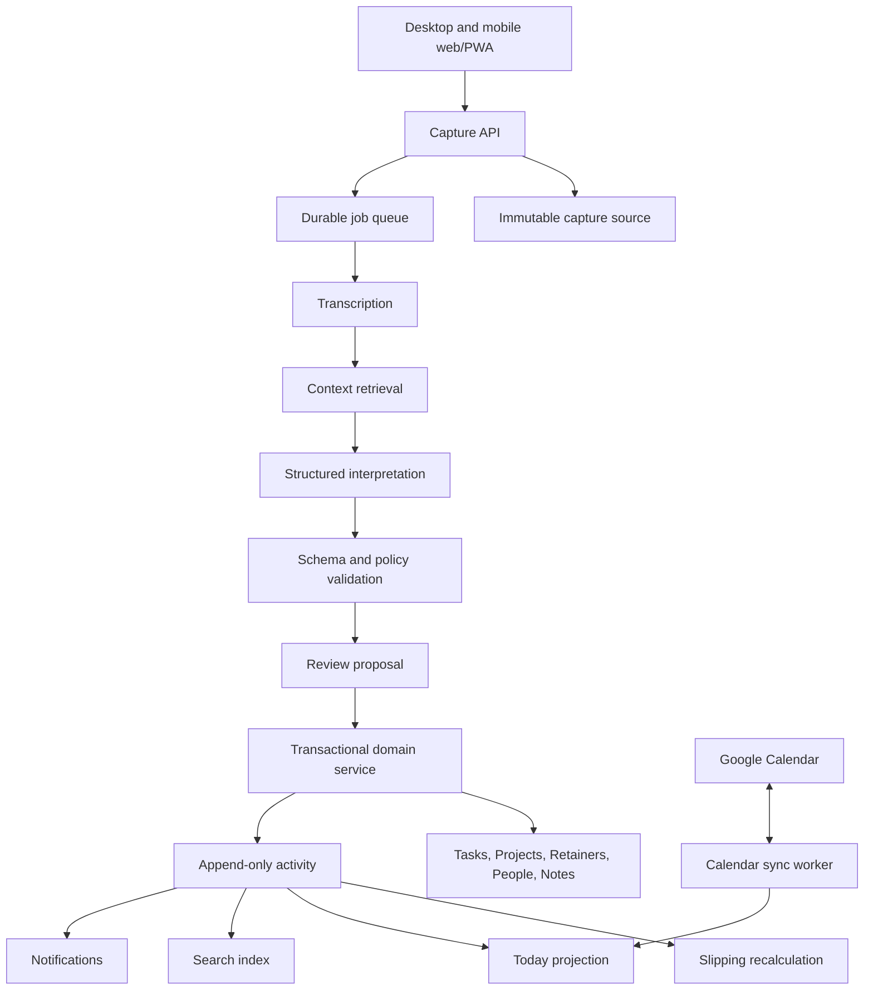

# Slipwell Product and Technical Specification

**Status:** Working build specification  
**Version:** 0.2  
**Last updated:** 2026-07-29  
**Product:** Slipwell  
**Initial release:** Private beta  
**Source documents:** [Idea assessment](idea-assessment.md) and [product strategy](product-strategy.md)

---

## 1. Purpose of this document

This document defines the first buildable version of Slipwell. It combines product requirements, interaction behavior, domain rules, system architecture, data design, AI behavior, security requirements, delivery phases, and acceptance criteria.

This is deliberately narrower than the complete product vision. The first release must prove three hypotheses:

1. Independent professionals will repeatedly capture thoughts by voice or text when routing is fast, trustworthy, and reversible.
2. Native support for recurring client retainers is more useful than reconstructing retainers from generic recurring tasks.
3. A cross-object "slipping" engine prevents valuable commitments from being neglected and creates a reason to return.

In this document:

- **Must** means required before the private beta can be called complete.
- **Should** means expected for the paid beta, but it may be deferred if it threatens the core loop.
- **May** means a later enhancement.

---

## 2. Product definition

### 2.1 One-sentence definition

Slipwell is a voice-first personal command center for independent professionals who manage recurring clients, projects, content, and personal commitments.

### 2.2 Product promise

> Capture anything in seconds. Slipwell files it where it belongs and brings it back before it quietly slips away.

### 2.3 The problem

The target user currently distributes work across reminders, a task manager, a calendar, notes, project boards, voice memos, and memory. Capturing a thought requires deciding which tool and structure to use. Reviewing work requires scanning several systems. Recurring client work is rebuilt every month or represented by brittle recurring tasks. Important work is often neither overdue nor visible; it simply receives no attention until it becomes a problem.

The core problem is therefore not a lack of storage. It is the effort required to:

- capture information while moving;
- turn unstructured thoughts into dependable actions and context;
- maintain recurring client commitments;
- decide what deserves attention now;
- detect important work that is becoming stale;
- find the supporting context later.

### 2.4 Initial target user

The primary user is a **creator-consultant**: an independent professional who serves recurring clients while also creating content to market or grow their business. This is the strongest launch identity because the same person naturally needs voice or text capture, client projects, monthly retainers, content workflows, relationship context, and personal commitments without the product inventing artificial use cases.

The primary user:

- manages at least three concurrent clients or projects;
- has one or more recurring monthly client commitments;
- creates content as part of their business;
- works across phone and desktop and often captures while away from a desk;
- currently uses at least two productivity tools;
- is willing to pay for a system that reliably prevents missed commitments.

Freelancers with recurring retainers are the closest secondary segment and should be included in research and beta recruitment, but the launch message should speak first to creator-consultants. Other secondary users include boutique agency owners, solo founders, fractional executives, independent coaches, and advisors. Team collaboration is not part of the initial release.

### 2.5 Jobs to be done

When a commitment or idea occurs to me, I want to capture it without choosing a destination, so I can return to what I was doing.

When I begin my day, I want one constrained view of my calendar, priorities, due work, and at-risk commitments, so I know what deserves attention.

When a new retainer cycle starts, I want the correct deliverables to appear while unfinished work is preserved, so nothing is lost or silently duplicated.

When work receives no attention, I want Slipwell to explain what is slipping and why, so I can act, defer it intentionally, or change its cadence.

When I need context about a client, project, person, or note, I want to retrieve the related records without remembering where I stored them.

### 2.6 Product principles

1. **Capture before organization.** The user should not need to select an object type before speaking or typing.
2. **Trust before automation.** Preserve the source, show proposed changes, expose confidence, and make every AI action reversible.
3. **Opinionated defaults before configuration.** Slipwell should work without building databases or designing workflows.
4. **Attention before volume.** Today must help the user choose, not present another infinite list.
5. **Cadence before due dates.** Important work can slip without being overdue.
6. **One source, connected context.** Tasks, projects, retainers, people, notes, and calendar events share relationships and activity history.
7. **Private by default.** Sensitive user content must not enter logs, analytics, or model training by accident.
8. **Portable by design.** The user owns their data and can export or delete it.

---

## 3. Success criteria

### 3.1 North-star behavior

The primary behavioral measure is:

> Weekly active users who complete the full loop at least twice per week: capture an item, accept or correct its routing, and later act on it from Today or Slipping.

This measures the product's differentiated loop rather than generic task creation.

### 3.2 Private-beta targets

| Metric | Target | Warning threshold |
|---|---:|---:|
| Median capture start to saved confirmation | under 8 seconds, excluding long audio duration | over 15 seconds |
| Captures processed without loss or unrecoverable duplication | at least 99.5% | below 98% |
| AI routes accepted without structural correction | at least 85% | below 70% |
| Activated users capturing on 4+ days in week one | at least 50% | below 30% |
| Activated-user weekly retention at week six | at least 40% | below 25% |
| Slipping signals that lead to act, defer, or intentional dismiss | at least 25% | below 10% |
| Retainer users completing one monthly rollover | at least 60% | below 35% |
| Retained users who reduce reliance on two existing tools | at least 25% | below 10% |
| Interviewed users willing to pay at least USD $12/month | at least 30% | below 15% |

### 3.3 Activation definition

A user is activated after they have:

1. connected one Google Calendar;
2. created or imported one project;
3. created one retainer or second project;
4. submitted three captures, at least one by voice;
5. accepted or corrected at least two capture proposals;
6. selected a Top 3 item on Today.

Activation should be measurable without inspecting user content.

---

## 4. Release scope

### 4.1 Required product surfaces

The private beta has seven primary surfaces:

1. **Capture** — voice or text entry and immediate processing status.
2. **Review** — proposed records, uncertain captures, recent routing, edit, and undo.
3. **Today** — Top 3, calendar, due work, slipping items, and routine summary if enabled.
4. **Tasks** — dependable task creation, scheduling, recurrence, completion, and filtering.
5. **Projects & Retainers** — finite projects and recurring service cycles.
6. **People & Notes** — lightweight context linked to work.
7. **Search & Settings** — global retrieval, integrations, notification control, export, and account management.

### 4.2 Included in the private beta

- Email or Apple sign-in.
- Single-user workspace.
- Responsive web application.
- Browser voice and text capture in the responsive web application.
- Installable PWA behavior where supported.
- In-app quick capture and keyboard shortcut.
- Durable browser-side offline capture queue using IndexedDB and retry on reconnect.
- AI transcription, cleanup, classification, extraction, and routing proposal.
- Review inbox with original source, confidence, correction, and undo.
- Tasks, finite projects, monthly retainers, people, and notes.
- Today with user-selected Top 3.
- Google Calendar read synchronization.
- Deterministic slipping rules for tasks, projects, and retainers.
- Keyword global search and structured filters.
- Push and email notification preferences.
- JSON, CSV, and Markdown export.
- Product analytics that contain no raw user content.

### 4.3 Included after core reliability is proven

- Semantic search.
- Grounded AI chat with record-level citations.
- People slipping cadence.
- Notes scheduled for resurfacing.
- Simple routines and streaks.
- Content project template and opinionated pipeline view.
- Task time-block writing to Google Calendar.
- Billing and AI usage quotas for paid beta.

### 4.4 Explicitly excluded from the first release

- Team workspaces, assignments, guests, or shared records.
- Full contact-book synchronization.
- Gmail or other email ingestion.
- Outlook Calendar.
- Native iPhone, iPad, Apple Watch, macOS, Android, Windows, or Linux capture clients.
- Browser extensions and system-wide desktop shortcuts.
- Arbitrary custom databases, fields, formulas, or user-defined object types.
- Inventory and possession tracking.
- Kindle or Readwise imports.
- Rich book, quote, or media library.
- Automatic calendar scheduling or calendar optimization.
- Complex project dependencies, Gantt charts, resource planning, or invoicing.
- General autonomous agents that mutate records without review.

---

## 5. Core concepts and terminology

| Term | Meaning |
|---|---|
| Workspace | Security and ownership boundary. The beta creates one personal workspace per user. |
| Capture | Immutable source input supplied by the user, including original text, audio, metadata, and processing state. |
| Proposal | A structured interpretation of a capture that has not yet been accepted. |
| Record | A task, project, retainer cycle, person, note, or other saved domain object. |
| Activity | Append-only evidence that a record was created, changed, completed, viewed meaningfully, or acknowledged. |
| Attention event | An activity that resets or advances an entity's slipping calculation. |
| Slipping rule | A deterministic expectation for when an entity should next receive attention. |
| Slipping signal | A current, explainable warning generated when a rule is met. |
| Retainer | A recurring client project template with a cadence, deliverables, and cycle history. |
| Retainer cycle | One concrete period of a retainer, initially a calendar month. |
| Top 3 | Up to three user-chosen focus items for a local day. Domain term only; the interface calls this "focus" per [DR-0001](./docs/decisions/0001-private-beta-interaction-contract.md). |
| Domain | A light top-level context such as Work, Personal, Family, or a user-created label. |

### 5.1 Record relationships

Records can be connected without being nested. Examples:

- a task belongs to a project and mentions a person;
- a note belongs to a client project and was captured from a calendar event;
- a retainer cycle generates tasks from template deliverables;
- a person relates to multiple projects;
- a capture creates one primary record and links it to existing context.

The MVP must support typed links rather than copying context between modules.

---

## 6. End-to-end user journeys

### 6.1 First-run onboarding

1. User signs in.
2. Slipwell asks for timezone and notification permission with an explanation.
3. User connects Google Calendar or explicitly skips.
4. Slipwell starts with creator-consultant defaults and asks which workflows apply: recurring clients, finite projects, content, or personal commitments.
5. Slipwell creates opinionated defaults for domains and slipping cadences.
6. User creates a first project and optionally a monthly retainer.
7. Slipwell demonstrates a sample voice capture and shows the resulting proposal.
8. User accepts or corrects it.
9. User selects one item for today's Top 3.
10. A checklist remains visible until activation or dismissal.

Onboarding must not require a user to configure every module.

### 6.2 Voice capture from the browser

1. User opens the persistent Capture action in Slipwell from a desktop or mobile browser.
2. The browser requests microphone permission when needed and begins recording after a clear user action.
3. User says: "Remind me Friday morning to send Sarah the Acme homepage draft."
4. The web client assigns an idempotency key, stores a local pending copy in IndexedDB, and uploads.
5. Slipwell acknowledges receipt immediately.
6. Backend transcribes and proposes:
   - task: "Send Sarah the Acme homepage draft";
   - due: Friday in the user's timezone;
   - reminder: Friday morning using the user's morning default;
   - linked person: Sarah;
   - linked project: Acme website, if entity resolution is confident.
7. The user receives a concise confirmation with the destination and an Edit action.
8. If the proposal is uncertain, it appears in Review and is not silently attached to a client.

The user must never lose the original audio or transcript because routing failed.

### 6.3 Retainer rollover

1. User creates an "Acme monthly marketing" retainer starting August 1.
2. User adds deliverable templates with expected start and due offsets.
3. At the start of a cycle, Slipwell creates the August cycle and its deliverable instances exactly once.
4. Unfinished July deliverables remain in July and are visibly carried forward as linked carryovers; they are not overwritten.
5. The Today and Slipping views distinguish August planned work from July carryover.
6. User can complete, cancel, move, or explicitly merge a carryover.
7. The cycle history remains available for comparison and future planning.

### 6.4 Slipping intervention

1. A project receives no attention for its seven-day cadence.
2. Slipwell creates one active slipping signal with the explanation "No task, note, or project update in 8 days."
3. The signal appears on Today without changing the project's due date or priority.
4. The user can:
   - open and work on the project;
   - create or complete a next action;
   - snooze until a chosen date;
   - change the expected cadence;
   - mark it intentionally paused;
   - dismiss this occurrence.
5. The selected action and reason are recorded for analytics and future rule tuning.

### 6.5 Correcting an AI route

1. A capture is incorrectly proposed as a note.
2. User opens Review and changes its type to task.
3. Compatible fields are preserved; incompatible fields remain in the source but are not forced into the task.
4. User corrects the project link and accepts.
5. Slipwell saves a routing-feedback event without sending raw private content to product analytics.
6. An Undo action is available for at least 30 days or until the affected record is permanently deleted.

---

## 7. Functional requirements

### 7.1 Authentication, workspace, and onboarding

**AUTH-01 — Account creation**  
The user must be able to authenticate with Apple or a magic-link email. A password-based flow is not required for beta.

**AUTH-02 — Personal workspace**  
Account creation must create exactly one personal workspace and membership record in one transaction.

**AUTH-03 — Tenant isolation**  
Every user-owned table must include a workspace identifier and be protected by row-level security. A user must never be able to infer the existence of another user's record.

**AUTH-04 — Timezone**  
The workspace must store an IANA timezone. Date phrases, Today, reminders, recurring tasks, and retainer cycles must use this timezone unless a record explicitly stores another timezone.

**AUTH-05 — Onboarding resume**  
The user can leave onboarding and resume without losing completed steps.

**Acceptance criteria**

- Repeating the account callback does not create duplicate workspaces.
- Changing timezone does not rewrite stored instants; it changes future display and recurrence interpretation according to documented rules.
- A test suite verifies cross-workspace access is denied for every exposed table and storage bucket.

### 7.2 Universal capture

**CAP-01 — Supported input**  
Capture must accept typed text and audio. An audio capture may include optional user-entered text.

**CAP-02 — Source provenance**  
Each capture records its source using a stable enum: web, iPhone, Apple Watch, macOS helper, share sheet, import, or API. The enum supports future ingestion paths; only web capture is required for the private beta.

**CAP-03 — Immediate durable receipt**  
The API must durably save the source before starting transcription or AI processing and return a capture ID.

**CAP-04 — Idempotency**  
Every client request must include a stable idempotency key. Retrying the same request returns the same capture rather than creating a duplicate.

**CAP-05 — Offline queue**  
The web client must locally queue a pending capture in IndexedDB when offline or when upload fails, show its status, and retry with backoff after reconnect. Sensitive local payloads must not be placed in `localStorage`. The user can manually retry or discard a pending item.

**CAP-06 — Processing states**  
A capture progresses through:

`local_pending → received → transcribing → interpreting → needs_review | ready → accepted | failed | discarded`

Each transition is timestamped. Failed captures preserve the source and expose a retry action.

**CAP-07 — Original preservation**  
The original text, original audio, transcript, cleaned text, proposals, and final decision must remain distinguishable. AI-cleaned text must never overwrite source text.

**CAP-08 — Capture feedback**  
After receipt, the user sees "Saved." After processing, the user sees the proposed destination, extracted date, and an Edit action. Notifications must avoid exposing sensitive content on a locked device unless the user opts in.

**CAP-09 — Limits**  
The client must show maximum recording length and current upload state. Default beta limit: five minutes per capture and 25 MB per audio file.

**Acceptance criteria**

- Killing the app after the server returns receipt does not lose the capture.
- Submitting the same idempotency key 20 times produces one source record.
- A transcription or model outage moves the capture to a recoverable failed state.
- No raw capture text appears in application logs or third-party analytics.

### 7.3 AI interpretation and routing

**AIR-01 — Allowed primary record types**  
MVP routing may propose one primary type: task, note, person update, project update, or inbox item.

**AIR-02 — Allowed operations**  
The proposal may create a record or propose an update to an existing record. Updates require stronger confidence and explicit evidence than creates.

**AIR-03 — Structured result**  
The model must return schema-validated structured output. It must not write directly to domain tables.

Minimum proposal structure:

```json
{
  "primaryType": "task",
  "operation": "create",
  "title": "Send Sarah the Acme homepage draft",
  "body": null,
  "dateText": "Friday morning",
  "dueAt": "2026-07-31T16:00:00Z",
  "reminderAt": "2026-07-31T16:00:00Z",
  "projectCandidate": {
    "id": "uuid-or-null",
    "label": "Acme website",
    "confidence": 0.94
  },
  "personCandidates": [
    {
      "id": "uuid-or-null",
      "label": "Sarah",
      "confidence": 0.91
    }
  ],
  "fieldConfidence": {
    "primaryType": 0.97,
    "title": 0.99,
    "dueAt": 0.88
  },
  "ambiguities": [],
  "summary": "Task for Friday morning, linked to Acme and Sarah"
}
```

**AIR-04 — Context minimization**  
The routing pipeline may retrieve only the minimum user context needed: likely domains, active projects, retainers, recently referenced people, timezone, and user defaults. It must not send the full workspace to the model.

**AIR-05 — Confidence policy**  
During onboarding, all proposals require confirmation. After the user has accepted at least 20 proposals, they may enable auto-file for high-confidence creates. Recommended thresholds:

- `≥ 0.90`: eligible for auto-file if all required fields and relationships pass validation;
- `0.65–0.89`: Review required;
- `< 0.65`: preserve as an inbox item and ask the user to classify it.

Updates to existing records, destructive changes, person merges, and date interpretations that could create an immediate or past-due reminder always require review in the beta.

**AIR-06 — Date interpretation**  
Relative dates must be resolved against the user's local timezone and capture timestamp. The UI must display the interpreted absolute date before acceptance. "Morning" uses a configurable default, initially 9:00 AM local time.

**AIR-07 — Entity resolution**  
The pipeline must prefer an existing exact or strongly matching project/person. If two candidates are plausible, it must expose the choices instead of guessing.

**AIR-08 — Safe fallback**  
A malformed model response, provider timeout, or ambiguous classification produces a recoverable inbox item. It must never discard a capture.

**AIR-09 — Auditability**  
Store the provider/model identifier, prompt-template version, response schema version, retrieved record IDs, confidence, latency, token usage, and proposal result. Do not place source content in general-purpose logs.

**AIR-10 — Provider independence**  
Transcription and interpretation must be behind internal interfaces. Domain logic must not depend on a provider-specific response object.

**Acceptance criteria**

- Invalid JSON or unknown enum values are rejected and retried or sent to Review.
- A proposal can be reconstructed from audit data without exposing secrets.
- The user can inspect which source capture produced a record.
- The AI cannot delete, merge, or publish records in the private beta.

### 7.4 Review inbox and undo

**REV-01 — Inbox sections**  
Review displays Needs attention, Ready to confirm, Failed, and Recently filed.

**REV-02 — Proposal editor**  
The editor must show source, cleaned text, destination type, title, body, date/reminder, domain, project, and people links.

**REV-03 — Batch safety**  
The user may batch-accept high-confidence creates. Batch updates or destructive operations are not allowed.

**REV-04 — Correction**  
Changing primary type revalidates fields. The original proposal remains in routing history.

**REV-05 — Undo**  
Acceptance generates a reversible mutation event. Undo restores prior values or soft-deletes a newly created record. Undo must be idempotent.

**REV-06 — Review count**  
Navigation displays the unresolved count. Counts update without a full page refresh.

**Acceptance criteria**

- Every accepted proposal can be traced to its source and mutation event.
- Undoing twice has the same result as undoing once.
- Correcting a route does not create an orphan record or leave stale relationships.

### 7.5 Today and Top 3

**TOD-01 — Local day**  
Today uses the workspace timezone and explicitly displays the date. It handles daylight-saving transitions.

**TOD-02 — Top 3**  
The user can select zero to three tasks, projects, retainer deliverables, or slipping signals as focus items. Slipwell may suggest items but cannot replace the user's selection automatically.

Rendered as "your focus"; "Top 3" is not user-facing. Each focus item states who added it and when, and a suggestion renders outside the focus list, explains the rule that produced it, and can be declined without anything else taking the slot. Pass A found that a section-level "chosen by you" label alone was not believed.

**TOD-03 — Sections**  
Today must include:

- Top 3;
- calendar agenda;
- due and overdue tasks;
- active slipping signals;
- retainer deliverables due soon;
- unresolved capture-review count;
- recent activity or quick capture.

**TOD-04 — Constraint**  
Collapsed sections show counts and a small preview. Today must not render every open task by default.

**TOD-05 — Carry forward**  
Incomplete Top 3 items do not silently remain selected forever. On the next local day, the user sees a carry-forward prompt and can retain, replace, schedule, or remove each item.

**TOD-06 — Completion**  
Tasks and deliverables can be completed inline. Project focus items require an explicit next action or acknowledgement to count as acted upon.

**TOD-07 — Suggestions**  
Suggested focus items are ranked using deterministic signals first: due state, slipping severity, retainer timing, priority, and recent deferrals. The reason must be visible.

**Acceptance criteria**

- A user cannot select a fourth Top 3 item without replacing an existing item.
- Completing an item updates Today, its parent project, activity history, and slipping calculation.
- Today remains useful when no calendar is connected.

### 7.6 Tasks

**TSK-01 — Fields**  
A task includes title, optional description, status, priority, start date, due date, reminder, recurrence, domain, parent project or retainer deliverable, linked people, tags, and source capture.

**TSK-02 — Statuses**  
Supported statuses are `inbox`, `open`, `in_progress`, `blocked`, `completed`, and `cancelled`.

**TSK-03 — Dates**  
Start date, due date, and reminder are separate. A task may have none. A due date must not implicitly create a calendar event.

**TSK-04 — Recurrence**  
The beta supports daily, weekly, monthly, yearly, and a validated subset of RRULE. Editing recurrence must ask whether the change affects this occurrence, future occurrences, or the series when relevant.

**TSK-05 — Completion**  
Completion records an activity and materializes the next recurring occurrence exactly once.

**TSK-06 — Project integrity**  
A task can have at most one primary project in the beta, but may link to multiple people and notes.

**TSK-07 — Defer**  
Deferring a task records an intentional attention event and a new review/start date. It must not erase the original due date without user confirmation.

**TSK-08 — Soft deletion**  
Deletion is recoverable for 30 days. Tasks referenced by audit history remain represented by a tombstone after permanent deletion.

**Acceptance criteria**

- Replaying a completion event does not create duplicate recurring occurrences.
- A task can be completed offline and reconciled without reverting newer server changes.
- Filters support status, project, retainer, person, domain, due state, and slipping state.

### 7.7 Finite projects

**PRJ-01 — Fields**  
A project includes name, description, kind, status, domain, owner workspace, optional client/person links, start date, target date, attention cadence, next review date, template source, and activity timestamps.

**PRJ-02 — Kinds and statuses**  
Kinds are `finite` and `retainer`. Finite statuses are `planning`, `active`, `paused`, `completed`, and `cancelled`.

**PRJ-03 — Project view**  
The view contains overview, next actions, tasks, linked people, notes, activity, and current slipping explanation.

**PRJ-04 — Next action**  
An active project should have at least one open next action. A missing next action is eligible for a slipping signal after a grace period.

**PRJ-05 — Templates**  
The beta may ship opinionated templates. Applying a template copies its structure and records the template version.

**PRJ-06 — Pause**  
Paused projects do not generate inactivity signals until the optional resume date. Existing overdue tasks remain visible unless separately deferred.

**Acceptance criteria**

- Creating a project from a template takes under two minutes in a usability test.
- Completing a project does not automatically complete open tasks without confirmation.
- Project activity summarizes domain events rather than storing a second conflicting history.

### 7.8 Retainers and recurring client work

**RET-01 — Retainer definition**  
A retainer is a project with:

- client/person relationship;
- cadence, initially monthly only;
- cycle anchor and workspace timezone;
- deliverable templates;
- expected start and due offsets;
- rollover behavior;
- cycle history.

**RET-02 — Deliverable templates**  
Each template contains name, description, expected start offset, due offset, default assignee placeholder, checklist or task templates, and slipping thresholds.

**RET-03 — Cycle generation**  
The system creates each cycle and its deliverables exactly once using an idempotent scheduled job. A user may generate the next cycle early.

**RET-04 — Rollover**  
At cycle close, incomplete deliverables must remain in their original cycle and receive one of:

- carried forward as a linked copy;
- moved to the new cycle with explicit history;
- cancelled;
- retained as overdue in the original cycle.

The default is "retain as overdue and suggest carry forward." Silent deletion and automatic duplication are prohibited.

**RET-05 — Cycle health**  
Each active cycle displays completion percentage, due-soon count, overdue count, carryovers, and attention status.

**RET-08 — The forward promise must be visible**  
A retainer surface states, without the user having to act, when the next cycle opens, which deliverables it will generate, and that generation happens exactly once. Template editing is reachable from the retainer itself, and saving an edit names the cycles it affects and the cycles it does not. Pass A found that a retrospective-only surface reads as a monthly reminder, which erases the product's primary differentiator; see [DR-0001](./docs/decisions/0001-private-beta-interaction-contract.md).

**RET-09 — Carryover provenance is stated, not implied**  
Wherever a carried deliverable appears, the interface states how many copies exist, which record is the original, and where the other one lives. Placing the original and the copy on adjacent surfaces is not sufficient.

**RET-06 — Exceptions**  
The user can skip a cycle, alter dates for one cycle, or pause the retainer without rewriting the template.

**RET-07 — Archive**  
Archiving a retainer preserves all prior cycles, activity, and links.

**Acceptance criteria**

- Concurrent workers cannot generate duplicate cycles or deliverables.
- Month-end behavior is correct for all timezones and months of different lengths.
- Template edits default to future cycles and do not mutate past cycle history.
- Carryover provenance is visible in both source and destination cycles.

### 7.9 Slipping engine

#### 7.9.1 Definition

Slipping is an explainable attention-risk state, not a synonym for overdue. V1 uses deterministic rules. Machine-learned ranking may be added only after sufficient behavior data and must not replace the visible reason.

#### 7.9.2 Attention events

An activity resets or advances cadence only if it reflects meaningful attention. Qualifying events include:

- completing, creating, rescheduling, or explicitly deferring a next action;
- changing project status or milestone;
- adding a substantive project note;
- completing or intentionally moving a retainer deliverable;
- acknowledging a slipping signal with a reason;
- recording a person interaction when person cadence is enabled.

Passive page views, background sync, search impressions, and notification delivery do not count.

#### 7.9.3 V1 rules

| Rule ID | Entity | Trigger | Default |
|---|---|---|---|
| SLIP-TASK-STALE | open task without a due date | no qualifying attention since creation or last attention | 14 days |
| SLIP-TASK-OVERDUE | open task with a due date | due date passed | immediately |
| SLIP-PROJECT-INACTIVE | active finite project | no qualifying attention | 7 days |
| SLIP-PROJECT-NEXT | active finite project | no open next action | 2 days |
| SLIP-RETAINER-START | retainer deliverable | not started by expected start offset | immediately at offset |
| SLIP-RETAINER-DUE | retainer deliverable | incomplete near or after due offset | warning 3 days before; critical after due |
| SLIP-CARRYOVER | retainer cycle | unresolved item from a closed prior cycle | immediately |

Post-MVP rules may cover people, notes marked for review, and content stage duration.

#### 7.9.4 Severity

Signals have `watch`, `at_risk`, and `critical` severity. Severity is derived from rule type and elapsed breach, not generated by a language model.

Example for an inactive project with a seven-day cadence:

- day 7–9: watch;
- day 10–13: at risk;
- day 14+: critical.

The exact thresholds are configurable at the system level and later per user.

#### 7.9.5 Signal lifecycle

A signal progresses through:

`active → acknowledged | snoozed | resolved | dismissed | obsolete`

- At most one active signal may exist for an entity and rule.
- A resolved signal remains in history.
- A snoozed signal has a visible wake date and does not immediately regenerate.
- Dismissal requires a lightweight reason such as not important, rule too aggressive, incorrect context, or handled elsewhere.
- Changing a rule recalculates future state and marks no-longer-applicable active signals obsolete.

**SLP-01 — Explainability**  
Every signal must state the rule, last qualifying attention, threshold, current elapsed time, and suggested actions.

**SLP-02 — No hidden priority mutation**  
Generating a signal does not alter priority, due date, task status, or project status.

**SLP-03 — Recalculation**  
Relevant domain events enqueue recalculation. A daily reconciliation job catches missed events.

**SLP-04 — Ranking**  
Today ranks signals by severity, client/retainer importance, due proximity, age, and repeated deferral. The UI exposes the main reason.

**Acceptance criteria**

- Recalculating the same unchanged entity is idempotent.
- Page views alone cannot resolve an inactivity signal.
- Paused or completed projects do not generate new inactivity signals.
- The engine can answer "Why am I seeing this?" without an AI call.

### 7.10 Google Calendar

**CAL-01 — Scope**  
Private beta supports read-only Google Calendar synchronization. Users choose which calendars appear.

**CAL-02 — OAuth**  
Request the minimum scopes required. OAuth tokens are encrypted at rest, never sent to the browser after exchange, and can be revoked from Settings.

**CAL-03 — Incremental sync**  
Use provider change notifications and incremental sync tokens. A periodic reconciliation handles missed notifications.

**CAL-04 — Event identity**  
Provider account ID, calendar ID, and provider event ID form the external identity. Updates must not create duplicates.

**CAL-05 — Sync health**  
Settings shows last successful sync, calendars included, errors, reconnect action, and token health.

**CAL-06 — Display**  
Today shows local start/end time, all-day state, source calendar, title, and location when permitted. Declined and cancelled-event behavior must be explicit.

**CAL-07 — Privacy**  
Users may mark a calendar "busy only," which stores and displays only time boundaries and availability state where technically possible.

**Acceptance criteria**

- Replaying a change notification does not duplicate events.
- A full resync reconciles deletes and updates.
- Expired or revoked credentials produce a visible reconnect state rather than silent stale data.
- DST, recurring events, all-day events, and moved instances have automated fixtures.

### 7.11 People

**PPL-01 — Lightweight records**  
A person includes display name, optional pronouns, organization, role, contact fields, notes, important dates, last interaction, next follow-up, and user-created private facts.

**PPL-02 — Relationships**  
People may link to tasks, projects, retainers, notes, calendar events, and captures.

**PPL-03 — AI safeguards**  
AI may propose a person update but cannot merge two people or overwrite existing facts without review.

**PPL-04 — Duplicate assistance**  
Potential duplicates are suggestions only. A merge preview lists all effects and is post-MVP unless needed to repair imports.

**PPL-05 — Contact sync**  
Native contact-book sync is excluded. The user may create people manually or through captures.

**Acceptance criteria**

- Ambiguous first names do not silently link to an arbitrary person.
- Deleting a person removes the relationship but does not delete linked tasks or projects.
- Private facts are excluded from notification previews and analytics.

### 7.12 Notes

**NTE-01 — Note types**  
MVP supports general note, project note, meeting note, and journal note.

**NTE-02 — Fields**  
A note includes title, Markdown-compatible body, type, captured timestamp, event date, domain, linked records, tags, sensitivity, and source capture.

**NTE-03 — Sensitivity**  
Journal notes default to sensitive. Sensitive content is hidden from lock-screen previews and excluded from model context unless the user explicitly includes it in the current action.

**NTE-04 — Versioning**  
Edits preserve a recoverable version history for at least 30 days.

**NTE-05 — Export**  
Notes export as Markdown with front matter and stable IDs.

**Acceptance criteria**

- A note may link to multiple records without duplicating its body.
- Changing note type does not alter the source capture.
- Search respects sensitivity and workspace authorization.

### 7.13 Search

**SEA-01 — Global search**  
Keyword search covers task titles/descriptions, project names/descriptions, retainer deliverables, people, and notes.

**SEA-02 — Filters**  
Results can be filtered by record type, status, domain, project, person, date range, and slipping state.

**SEA-03 — Permissions**  
Search results must use the same workspace and sensitivity authorization as direct record access.

**SEA-04 — Ranking**  
Initial ranking combines text relevance, exact-title match, recency, active status, and relationship proximity.

**SEA-05 — Semantic beta**  
Semantic search, when enabled, must preserve record-level source IDs and may not return text the user is unauthorized to open.

**Acceptance criteria**

- A known item is reachable in fewer than three interactions in usability testing.
- Deleted and soft-deleted records do not appear in normal search.
- Indexing delay is visible if it exceeds 30 seconds.

### 7.14 Notifications

**NTF-01 — Types**  
Supported notification categories are capture result, capture failure, task reminder, daily brief, slipping digest, retainer warning, and integration health.

**NTF-02 — Defaults**  
Capture failures and explicitly created reminders are on. Marketing is off. Slipping defaults to one digest rather than one notification per signal.

**NTF-03 — Quiet hours**  
The user sets quiet hours and timezone. Critical integration failures may appear in-app but do not bypass quiet hours.

**NTF-04 — Privacy**  
Each category supports full preview, generic preview, or disabled lock-screen content.

**NTF-05 — Deduplication**  
Notification jobs use stable keys. Retries must not send duplicate user-visible notifications.

**Acceptance criteria**

- Changing timezone recalculates future daily briefs without duplicating them.
- Completing an item before delivery cancels or invalidates its reminder.
- The user can disable each category and channel independently.

### 7.15 Data export, deletion, and account controls

**DAT-01 — Export**  
The user can request an export containing JSON for all records and activity, CSV for common tabular records, Markdown for notes, and original media where retained.

**DAT-02 — Export status**  
Large exports run asynchronously and use a short-lived signed download link.

**DAT-03 — Account deletion**  
Deletion requires reauthentication, explains consequences, revokes external tokens, and places the workspace into a 30-day recoverable deletion period before permanent deletion.

**DAT-04 — Immediate sensitive deletion**  
The user may permanently delete an individual audio source before the workspace recovery period, subject to clearly disclosed backup-retention limits.

**DAT-05 — Model controls**  
Settings explains which categories can be sent to AI providers. Sensitive notes are excluded by default.

**Acceptance criteria**

- Export includes stable identifiers and relationship mappings.
- Revoking Google access stops future sync and deletes or retains cached events according to the user's chosen option.
- Deletion jobs are auditable without retaining deleted content in application logs.

---

## 8. Information architecture and interaction model

### 8.1 Primary navigation

Frozen for the private beta by
[DR-0001](./docs/decisions/0001-private-beta-interaction-contract.md).

Desktop, in order:

- Today
- Review
- Slipping
- Tasks
- Projects
- Retainers
- Notes

The three attention surfaces lead. Retainers is a top-level destination even
though a retainer is a project in the domain model, because it is the workflow
the beta must prove and because closing a cycle has no equivalent in Projects.

People is not a primary destination. Person pages exist and are reached from
the records that mention a person, and from search, which keeps People the
lightweight contextual record the beta scope requires rather than implying a
contact book.

A persistent Capture button and keyboard shortcut are available from every
surface. Search and Settings are utility surfaces rather than content
destinations: Search is in the top bar and on a keyboard shortcut, Settings is
under the account menu.

Mobile:

- Today
- Retainers
- Capture
- Slipping
- Review

Capture is the prominent center action. Search is accessible from the top bar and system integrations.

### 8.2 Global commands

- `⌘/Ctrl + K`: search and command menu while the app is focused;
- `C`: text capture when focus is not in an input;
- `Esc`: close transient capture without discarding already submitted input.

### 8.3 Loading, empty, error, and stale states

Every asynchronous surface must define:

- skeleton or progress state;
- genuinely empty state with one next action;
- retryable error state;
- permission or integration error;
- offline state;
- last-updated or stale-data indicator where relevant.

"No slipping items" should be treated as a positive state, not an invitation to create more work.

### 8.4 Accessibility

- Meet WCAG 2.2 AA for the web experience.
- All actions must be keyboard accessible.
- Focus order and focus restoration must be tested in capture and review dialogs.
- Color cannot be the only indicator of priority, severity, or status.
- Touch targets must be at least 44 by 44 points on Apple clients.
- VoiceOver labels must distinguish source text, AI proposal, confidence, and final record.
- Reduced-motion settings must be respected.

### 8.5 Responsive and performance expectations

- Today and quick capture must be usable at 320 px width.
- Largest Contentful Paint target: under 2.5 seconds at p75 on a typical broadband mobile connection.
- Primary navigation feedback: under 100 ms where local state is available.
- Server API p95 excluding third-party AI: under 750 ms for normal CRUD.
- Capture receipt p95: under 1.5 seconds on a healthy connection.
- Long processing must be asynchronous and must not hold an HTTP request open.

---

## 9. Domain state machines

### 9.1 Capture

```text
local_pending
  └─ received
      ├─ transcribing
      │   ├─ failed
      │   └─ interpreting
      └─ interpreting
          ├─ failed
          ├─ needs_review
          └─ ready
              ├─ accepted
              └─ discarded
```

A failed capture may re-enter transcribing or interpreting. Accepted and discarded are terminal for the proposal, but the source remains available according to retention settings.

### 9.2 Task

```text
inbox → open → in_progress → completed
          │          │
          ├──────────┤
          ↓          ↓
        blocked    cancelled
```

Completed and cancelled tasks may be reopened. Reopening a recurring occurrence does not remove later occurrences.

### 9.3 Finite project

```text
planning → active ⇄ paused → completed
              └────────────→ cancelled
```

Completed and cancelled projects can be reopened only with explicit confirmation.

### 9.4 Retainer cycle

```text
planned → active → closing → closed
              └───────────→ skipped
```

Closing is a transactional workflow that resolves incomplete deliverables. A cycle cannot become closed while items remain in an unspecified rollover state.

---

## 10. Data model

### 10.1 Conventions

- Primary keys are UUIDv7 or another time-sortable UUID.
- All tables include `created_at` and `updated_at` as UTC instants.
- User-visible dates store both the instant where applicable and the timezone/civil-date semantics needed for recurrence.
- All user-owned rows include `workspace_id`.
- Deletable domain tables include `deleted_at`.
- Optimistic concurrency uses an integer `version`.
- Flexible JSON is allowed for provider payloads and versioned proposal schemas, not as a substitute for core relational fields.
- Foreign keys and unique constraints enforce idempotency and tenant integrity.
- User content is protected by TLS, managed database/storage encryption at rest, strict row-level security, and least-privilege service access. OAuth tokens and other credentials additionally use application-level envelope encryption.
- Searchable content is not described as application-encrypted in this schema because Postgres full-text indexing must be able to read it. If field-level encryption is later required for selected content, that content needs a separate blind-index or client-side-search design and cannot silently remain in the standard search index.

### 10.2 Core identity tables

#### `profiles`

- `user_id`
- `display_name`
- `locale`
- `default_timezone`
- `onboarding_state`
- `created_at`, `updated_at`

#### `workspaces`

- `id`
- `name`
- `timezone`
- `week_start`
- `morning_time`
- `quiet_hours`
- `plan`
- `created_at`, `updated_at`, `deletion_requested_at`

#### `workspace_members`

- `workspace_id`
- `user_id`
- `role` (`owner` only in beta)
- unique `(workspace_id, user_id)`

### 10.3 Capture and AI tables

#### `captures`

- `id`, `workspace_id`
- `idempotency_key`
- `source`
- `input_type` (`text`, `audio`, `mixed`)
- `original_text`
- `audio_object_key`
- `client_captured_at`
- `client_timezone`
- `status`
- `failure_code`
- `retention_class`
- unique `(workspace_id, idempotency_key)`

#### `capture_transcripts`

- `id`, `workspace_id`, `capture_id`
- `provider`, `model`
- `language`
- `transcript`
- `cleaned_text`
- `duration_ms`
- `provider_request_id`
- `created_at`

#### `capture_proposals`

- `id`, `workspace_id`, `capture_id`
- `schema_version`
- `prompt_version`
- `provider`, `model`
- `proposal_json`
- `primary_type`
- `operation`
- `overall_confidence`
- `status`
- `reviewed_at`
- `accepted_mutation_id`

#### `ai_runs`

- `id`, `workspace_id`
- `capture_id`, `proposal_id`
- `purpose`
- `provider`, `model`
- `prompt_version`, `schema_version`
- `retrieved_entity_ids`
- `latency_ms`
- `input_tokens`, `output_tokens`
- `estimated_cost`
- `result_status`
- `error_code`

### 10.4 Domain tables

#### `domains`

- `id`, `workspace_id`
- `name`, `color`, `position`

#### `project_templates`

- `id`
- optional `workspace_id` for future personal templates
- `name`, `description`
- `template_kind`
- `version`
- `structure_json`
- `active`

#### `tasks`

- `id`, `workspace_id`
- `title`, `description`
- `status`, `priority`
- `domain_id`, `project_id`
- `retainer_deliverable_id`
- `retainer_task_template_id`
- `start_on`, `due_at`, `due_on`, `due_timezone`
- `reminder_at`
- `recurrence_rule`, `recurrence_series_id`
- `source_capture_id`
- `completed_at`, `cancelled_at`
- `last_attention_at`
- `version`, `deleted_at`
- unique `(retainer_deliverable_id, retainer_task_template_id)` where both are present

#### `projects`

- `id`, `workspace_id`
- `kind` (`finite`, `retainer`)
- `name`, `description`
- `status`, `domain_id`
- `start_on`, `target_on`
- `attention_cadence_days`
- `last_attention_at`, `next_review_on`
- `template_id`, `template_version`
- `version`, `deleted_at`

#### `retainer_settings`

- `project_id`, `workspace_id`
- `client_person_id`
- `cadence` (`monthly`)
- `anchor_day`
- `timezone`
- `default_rollover_policy`
- `paused_until`

#### `retainer_deliverable_templates`

- `id`, `workspace_id`, `project_id`
- `name`, `description`
- `expected_start_offset`
- `due_offset`
- `position`
- `active_from_cycle`
- `retired_after_cycle`
- `version`

#### `retainer_task_templates`

- `id`, `workspace_id`, `deliverable_template_id`
- `title`, `description`
- `start_offset`, `due_offset`
- `position`
- `version`

#### `retainer_cycles`

- `id`, `workspace_id`, `project_id`
- `cycle_key` such as `2026-08`
- `starts_on`, `ends_on`
- `status`
- `generated_at`, `closed_at`
- unique `(project_id, cycle_key)`

#### `retainer_deliverables`

- `id`, `workspace_id`, `cycle_id`, `template_id`
- `name`, `description`
- `status`
- `expected_start_on`, `due_on`
- `started_at`, `completed_at`
- `carryover_from_id`
- `resolution`
- unique `(cycle_id, template_id)` where applicable

#### `people`

- `id`, `workspace_id`
- `display_name`
- `organization`, `role`, `pronouns`
- `email`, `phone`
- `private_facts`
- `last_interaction_at`, `next_follow_up_on`
- `source_capture_id`
- `version`, `deleted_at`

#### `person_dates`

- `id`, `workspace_id`, `person_id`
- `label`
- `month`, `day`, optional `year`
- `reminder_offset_days`
- unique user-meaningful constraint per person and label

#### `notes`

- `id`, `workspace_id`
- `title`
- `body`
- `note_type`
- `sensitivity`
- `domain_id`
- `event_at`
- `source_capture_id`
- `version`, `deleted_at`

#### `tags`

- `id`, `workspace_id`
- `name`, `color`
- unique case-insensitive `(workspace_id, name)`

#### `taggings`

- `id`, `workspace_id`, `tag_id`
- `entity_type`, `entity_id`
- unique `(workspace_id, tag_id, entity_type, entity_id)`

#### `entity_links`

- `id`, `workspace_id`
- `from_type`, `from_id`
- `to_type`, `to_id`
- `link_type`
- unique typed edge constraint

Application services must validate both endpoints belong to the same workspace. A future migration to typed relation tables is acceptable if polymorphic integrity becomes burdensome.

### 10.5 Attention and history tables

#### `activity_events`

- `id`, `workspace_id`
- `actor_type`, `actor_id`
- `entity_type`, `entity_id`
- `event_type`
- `occurred_at`
- `qualifies_as_attention`
- `source_capture_id`
- `mutation_id`
- `metadata_json`

Events are append-only. Metadata must not duplicate full sensitive record bodies.

#### `mutation_events`

- `id`, `workspace_id`
- `actor_id`
- `reason` (`user`, `capture_accept`, `sync`, `system_job`)
- `forward_patch`
- `inverse_patch`
- `undone_at`
- `created_at`

#### `slipping_rules`

- `id`, `workspace_id`
- `rule_type`
- `entity_type`
- `entity_id` nullable for defaults
- `threshold_json`
- `enabled`
- `version`

#### `slipping_signals`

- `id`, `workspace_id`
- `rule_id`
- `entity_type`, `entity_id`
- `severity`, `status`
- `reason_code`
- `last_attention_at`
- `threshold_at`
- `detected_at`
- `snoozed_until`
- `resolution_action`
- unique active signal constraint for entity and rule

#### `daily_priorities`

- `id`, `workspace_id`
- `local_date`
- `position` (1–3)
- `entity_type`, `entity_id`
- `selected_by` (`user`, `carried`)
- unique `(workspace_id, local_date, position)`
- unique `(workspace_id, local_date, entity_type, entity_id)`

### 10.6 Search tables

#### `search_documents`

- `id`, `workspace_id`
- `entity_type`, `entity_id`
- `title`
- `search_vector`
- `content_hash`
- `indexed_at`
- unique `(workspace_id, entity_type, entity_id)`

The search document is a derived projection, not a second source of truth. Updates are published through the transactional outbox. Deleting or restricting a source record must synchronously make its prior search document ineligible for results, even if physical index cleanup is asynchronous.

#### `semantic_embeddings`, post-MVP

- `id`, `workspace_id`
- `entity_type`, `entity_id`
- `chunk_index`
- `source_hash`
- `embedding_model`
- `embedding`
- `indexed_at`
- unique `(workspace_id, entity_type, entity_id, chunk_index, source_hash)`

Embedding jobs must exclude sensitive records by default and re-check authorization and current source state before returning results.

### 10.7 Integration and delivery tables

#### `calendar_connections`

- `id`, `workspace_id`
- `provider`
- `provider_account_id`
- encrypted access and refresh token references
- `status`
- `last_sync_at`, `last_error_code`

#### `calendar_sources`

- `id`, `workspace_id`, `connection_id`
- `provider_calendar_id`
- `name`, `color`
- `selected`, `privacy_mode`
- `sync_token_encrypted`

#### `calendar_events`

- `id`, `workspace_id`, `calendar_source_id`
- `provider_event_id`, `provider_updated_at`
- `title`, `description`, `location`
- `starts_at`, `ends_at`
- `start_on`, `end_on`, `all_day`
- `status`, `recurring_event_id`
- unique `(calendar_source_id, provider_event_id)`

#### `notification_preferences`

- `workspace_id`
- category/channel settings
- preview modes
- quiet hours
- daily brief time

#### `device_installations`

- `id`, `workspace_id`, `user_id`
- `platform`
- `push_token_encrypted`
- `client_version`
- `last_seen_at`
- `notifications_authorized`
- unique active token constraint

#### `notification_deliveries`

- `id`, `workspace_id`
- `deduplication_key`
- `category`, `channel`
- `scheduled_at`, `sent_at`
- `status`, `failure_code`
- unique `deduplication_key`

#### `jobs`

- `id`, `workspace_id` nullable
- `job_type`
- `deduplication_key`
- `payload_json`
- `status`
- `attempts`, `max_attempts`
- `run_after`, `locked_at`
- `last_error_code`
- unique job-type and deduplication key constraint

Job payloads should normally contain record identifiers and operation parameters, not duplicated user content.

#### `exports`

- `id`, `workspace_id`
- `status`
- `format_version`
- `object_key`
- `expires_at`
- `failure_code`
- `created_at`, `completed_at`

---

## 11. API specification

All endpoints are versioned under `/api/v1`, require authentication unless noted, validate input and output schemas, enforce workspace access server-side, and return a request ID. Mutation endpoints accept an idempotency key.

### 11.1 Capture

| Method | Path | Purpose |
|---|---|---|
| `POST` | `/captures` | Create text capture or initialize audio upload |
| `POST` | `/captures/{id}/audio-complete` | Confirm uploaded audio and enqueue processing |
| `GET` | `/captures/{id}` | Get source-safe status and proposal summary |
| `POST` | `/captures/{id}/retry` | Retry a failed processing stage |
| `POST` | `/captures/{id}/discard` | Discard unresolved capture |
| `GET` | `/captures/review` | List review inbox |
| `PATCH` | `/proposals/{id}` | Correct proposal fields |
| `POST` | `/proposals/{id}/accept` | Apply validated proposal transactionally |
| `POST` | `/mutations/{id}/undo` | Apply inverse mutation idempotently |

Audio uploads use short-lived signed upload URLs. Clients never receive storage service credentials.

### 11.2 Today and slipping

| Method | Path | Purpose |
|---|---|---|
| `GET` | `/today?date=YYYY-MM-DD` | Aggregated Today payload |
| `PUT` | `/today/{date}/priorities` | Replace ordered Top 3 atomically |
| `POST` | `/today/{date}/carry-forward` | Resolve previous-day focus items |
| `GET` | `/slipping` | List signals with filters and explanations |
| `POST` | `/slipping/{id}/acknowledge` | Record action or acknowledgement |
| `POST` | `/slipping/{id}/snooze` | Snooze to an explicit instant/date |
| `POST` | `/slipping/{id}/dismiss` | Dismiss with reason |
| `PATCH` | `/slipping/rules/{id}` | Change cadence or enablement |

### 11.3 Domain records

Conventional list, get, create, patch, and soft-delete endpoints exist for:

- `/tasks`
- `/projects`
- `/retainers`
- `/retainers/{id}/cycles`
- `/people`
- `/notes`
- `/domains`

Special operations use explicit commands:

- `POST /tasks/{id}/complete`
- `POST /tasks/{id}/defer`
- `POST /projects/{id}/pause`
- `POST /retainers/{id}/generate-cycle`
- `POST /retainer-cycles/{id}/close`
- `POST /retainer-deliverables/{id}/resolve-carryover`

Command endpoints are preferred where a generic patch would hide important invariants.

### 11.4 Search, integration, and account

| Method | Path | Purpose |
|---|---|---|
| `GET` | `/search` | Keyword and filtered search |
| `POST` | `/integrations/google/connect` | Begin OAuth with state and PKCE |
| `GET` | `/integrations/google/callback` | Complete OAuth |
| `GET` | `/integrations/google/calendars` | List and select sources |
| `POST` | `/integrations/google/sync` | Request reconciliation |
| `DELETE` | `/integrations/google` | Revoke and disconnect |
| `GET` | `/settings` | User/workspace settings |
| `PATCH` | `/settings` | Update allowed settings |
| `POST` | `/exports` | Request portable export |
| `GET` | `/exports/{id}` | Get state and signed download |
| `POST` | `/account/deletion-request` | Begin recoverable deletion |

### 11.5 Error format

```json
{
  "error": {
    "code": "CAPTURE_PROCESSING_FAILED",
    "message": "Your capture is safe, but Slipwell could not interpret it.",
    "retryable": true,
    "requestId": "req_...",
    "details": {}
  }
}
```

Messages must state whether user data is safe and what the user can do next. Internal stack traces and provider payloads are never returned.

---

## 12. System architecture

### 12.1 Recommended implementation

| Layer | Decision |
|---|---|
| Web | TypeScript and Next.js responsive application with PWA manifest, service worker where useful, microphone capture, and IndexedDB offline queue |
| API | TypeScript service layer behind Next.js server routes or a separately deployable Node service |
| Database | Supabase Postgres with row-level security |
| Authentication | Supabase Auth with Apple and email magic link |
| Object storage | Private Supabase Storage buckets with signed URLs |
| Search | Postgres full-text search; pgvector added for semantic beta |
| Background jobs | Durable queue and worker process with retries, deduplication, schedules, and dead-letter visibility |
| Realtime | Small invalidation/status updates only; core correctness must not depend on realtime delivery |
| AI | Internal transcription and structured-routing interfaces with versioned prompts and schemas |
| Observability | Structured redacted logs, traces, metrics, error tracking, and job dashboard |

### 12.2 Logical flow



### 12.3 Service boundaries

Initial deployment may be a modular monolith. Code boundaries must still separate:

- identity and authorization;
- capture ingestion;
- AI/transcription orchestration;
- proposal review and mutation application;
- task/project/retainer domain logic;
- activity and undo;
- slipping evaluation;
- calendar synchronization;
- search indexing;
- notifications;
- export and deletion.

Background workers call domain services rather than updating tables ad hoc.

### 12.4 Consistency model

- Capture receipt and proposal acceptance require strong transactional consistency.
- Activity event creation occurs in the same transaction as the domain mutation.
- Search, Today aggregation caches, slipping recalculation, and notifications may be eventually consistent.
- The UI must show pending state where eventual consistency is user-visible.
- An outbox pattern publishes post-transaction work so domain commits cannot be lost between database and queue.

### 12.5 Offline and conflict policy

- Capture is offline-first and never blocked on reading current server state.
- Task completion and simple edits may queue offline.
- Server records use optimistic version checks.
- Non-overlapping changes may merge automatically.
- Conflicting edits produce an explicit conflict view; last-write-wins is not acceptable for note bodies, dates, or status transitions.
- Calendar is provider-authoritative in read-only beta.

---

## 13. Security, privacy, and compliance requirements

### 13.1 Security baseline

- Enforce row-level security on every exposed user table.
- Never ship service-role credentials to a client.
- Encrypt OAuth tokens and designated sensitive fields with keys outside the database.
- Keep storage buckets private and use short-lived signed URLs.
- Validate MIME type, extension, and file size; scan uploaded media as appropriate.
- Rate-limit authentication, capture, AI, export, and webhook endpoints.
- Verify Google webhook authenticity and OAuth state.
- Use CSRF protection where cookie authentication is present.
- Use secure, HTTP-only, same-site cookies on web.
- Maintain dependency and secret scanning in CI.
- Back up Postgres and test restoration.
- Separate production, staging, and local environments.

### 13.2 Privacy rules

- Product analytics must use IDs and event categories, never titles, note bodies, transcripts, person names, or calendar descriptions.
- Error reporting must scrub request bodies and query strings.
- AI providers must be configured for no training on customer data where the provider supports it.
- Provider retention and subprocessors must be disclosed.
- Sensitive notes are excluded from proactive retrieval by default.
- User content must not be used to train Slipwell models without separate, revocable opt-in.
- Lock-screen notification previews default to generic for captures, people, and sensitive notes.

### 13.3 Threat scenarios that must be tested

- authenticated user attempts to access another workspace by changing a UUID;
- signed media URL is reused after expiration;
- malicious audio metadata or uploaded content;
- prompt injection embedded in a note or calendar description;
- AI proposes an update to the wrong client with a similar name;
- duplicated webhook or queue delivery;
- stolen or revoked Google refresh token;
- export link guessed or shared;
- staff access to production content;
- deletion requested while jobs and exports are in flight.

### 13.4 Administrative access

The beta should avoid building a content-browsing admin panel. Support diagnostics should expose processing state, provider error codes, hashed/opaque record IDs, and user-consented troubleshooting bundles. Any exceptional content access must require explicit user consent, a time limit, a reason, and an audit record.

---

## 14. AI safety and quality evaluation

### 14.1 Evaluation dataset

Before private beta, create a synthetic and consented evaluation set covering:

- task versus note ambiguity;
- client and project names that sound similar;
- relative dates around midnight, weekends, month-end, leap day, and DST;
- corrections and negations such as "don't remind me";
- multiple actions in one capture;
- journal language that should not become a task;
- person facts versus follow-ups;
- retainer cycle references such as "next month's report";
- noisy audio, accents, interruptions, and filler words;
- prompt injection within imported or retrieved context.

Do not use private beta content in a permanent evaluation set without explicit consent and redaction.

### 14.2 Quality measures

- transcription word-error rate on representative audio;
- primary-type precision and recall;
- required-field validity;
- date extraction exact match;
- correct project/person entity link rate;
- false update rate;
- percentage accepted unchanged;
- percentage safely routed to Review;
- unrecoverable failure rate;
- latency and cost per capture.

Routing acceptance alone is insufficient because users may accept mistakes quickly. Sampled, consented quality review and downstream correction frequency should also be measured.

### 14.3 Multiple intents

For the first beta, one capture may propose one primary record plus relationships. If a user clearly asks for multiple independent actions, the proposal editor can present multiple creates, but each must be individually visible and removable. The system must not silently omit the second intent.

### 14.4 Grounded AI chat, post-MVP

AI chat must:

- retrieve a bounded set of authorized records;
- cite each factual claim to clickable source records;
- distinguish record facts from inference;
- say when evidence is insufficient;
- not mutate records from chat without a separate proposal/confirmation flow;
- exclude sensitive notes unless explicitly included;
- support deletion of conversation history.

---

## 15. Analytics and experimentation

### 15.1 Event taxonomy

Permitted events include:

- `onboarding_step_completed`
- `calendar_connected`
- `capture_started`
- `capture_received`
- `capture_processed`
- `capture_failed`
- `proposal_viewed`
- `proposal_accepted`
- `proposal_corrected`
- `mutation_undone`
- `top3_selected`
- `task_completed`
- `retainer_created`
- `retainer_cycle_generated`
- `retainer_cycle_closed`
- `slipping_signal_viewed`
- `slipping_signal_acted`
- `search_performed`
- `export_requested`

Properties may include source type, record type, latency bucket, confidence bucket, rule type, severity, and plan. They must not include content or personal names.

### 15.2 Required dashboards

- capture funnel by source and client version;
- processing latency and failures by stage/provider;
- classification acceptance and correction by type;
- activation funnel;
- week 1 through week 8 cohort retention;
- Today and Top 3 engagement;
- slipping action rate by rule and severity;
- retainer cycle generation and close success;
- notification delivery and disable rate;
- estimated AI cost per active and paying user.

### 15.3 Experiment guardrails

Experiments may change onboarding copy, default views, digest timing, or suggested actions. Experiments may not silently change privacy defaults, auto-file thresholds, data retention, destructive confirmations, or slipping definitions.

---

## 16. Reliability and observability

### 16.1 Service targets for paid beta

| Area | Target |
|---|---:|
| Capture API monthly availability | 99.9% |
| Normal CRUD API monthly availability | 99.9% |
| Capture receipt p95 | under 1.5 seconds |
| Text interpretation p95 | under 10 seconds |
| Short audio transcription and interpretation p95 | under 30 seconds after upload |
| Calendar freshness after provider notification | under 5 minutes p95 |
| Reminder delivery | within 2 minutes p95 where platform delivery allows |
| Restore point objective | 24 hours or better |
| Restore time objective | 4 hours or better |

Third-party delivery limitations must be measured separately from Slipwell's own queue delay.

### 16.2 Operational requirements

- Trace a capture from client idempotency key through storage, AI runs, proposal, mutation, activity, and notification.
- Alert on capture loss indicators, queue age, dead-letter growth, sync-token invalidation, notification backlog, elevated AI schema failures, and cross-tenant authorization failures.
- Provide replay tools that preserve idempotency.
- Define runbooks for transcription outage, model outage, calendar webhook outage, queue stall, compromised integration token, and bad slipping-rule deployment.
- Use feature flags for AI providers, auto-file, semantic search, and new slipping rules.

---

## 17. Testing strategy

### 17.1 Unit tests

- recurrence and timezone calculation;
- retainer month boundaries and offsets;
- slipping rule evaluation and severity;
- confidence gating;
- proposal schema validation;
- inverse mutation generation;
- notification deduplication;
- search authorization filters.

### 17.2 Integration tests

- authentication and RLS for every table;
- capture upload through accepted proposal;
- queue retry and dead-letter behavior;
- recurring task completion;
- retainer cycle generation under concurrent workers;
- Google incremental sync, deletes, and invalid token recovery;
- export and account deletion;
- signed storage URL expiry.

### 17.3 End-to-end tests

1. New user onboards, connects calendar, captures a task, corrects it, selects it for Top 3, and completes it.
2. Offline browser capture syncs after reconnect without duplication.
3. Retainer reaches month-end with complete and incomplete deliverables and closes correctly.
4. Inactive project generates a slipping signal; user snoozes it; it returns on the correct date.
5. OAuth token expires; the user sees reconnect state and existing cached events do not silently appear current.
6. User exports data and verifies record relationships.
7. User requests deletion while pending captures exist.

### 17.4 Security tests

- automated RLS negative tests;
- authorization fuzzing with cross-workspace identifiers;
- webhook replay and forgery tests;
- dependency scanning and static analysis;
- rate-limit tests;
- independent penetration test before broad public launch.

### 17.5 Usability tests

Observe at least ten target users performing:

- first voice capture without coaching;
- correcting a wrong route;
- creating a monthly retainer;
- understanding a carryover;
- explaining why a project is slipping;
- selecting Top 3;
- finding a known note or client task.

Do not rely only on stated preference; record completion, time, errors, and hesitation.

---

## 18. Delivery plan

The sequence below is outcome-gated rather than a fixed launch commitment.

### Phase 0 — Validation and interactive prototype

**Goal:** Validate language, target user, and trust model before building production infrastructure.

Deliver:

- 25–40 interviews with target users;
- clickable Capture → Proposal → Today → Slipping prototype;
- concierge routing for a small set of real examples;
- tested retainer rollover concepts;
- finalized information architecture.

Exit criteria:

- at least half of interviewees report recurring commitments being missed or manually rebuilt;
- at least one-third pay for multiple relevant tools;
- users understand the proposal/review model without extensive explanation;
- slipping is perceived as more useful than another overdue view.

### Phase 1 — Foundations

**Goal:** Establish security, domain invariants, and durable capture.

Deliver:

- repository and CI/CD;
- environments and secrets management;
- Auth, workspace, RLS, and storage policies;
- core task/project/people/note schema;
- capture API, idempotency, local queues, and processing states;
- job/outbox infrastructure;
- redacted logging and trace IDs.

Exit criteria:

- RLS negative test suite passes;
- duplicate capture and job tests pass;
- a capture remains recoverable through simulated provider outages.

### Phase 2 — Capture and daily loop

**Goal:** Make capture, review, tasks, and Today usable end to end.

Deliver:

- responsive web application;
- browser voice and text capture;
- PWA installation and IndexedDB offline queue;
- transcription and structured routing;
- Review inbox and undo;
- task management;
- Today and Top 3;
- basic notifications.

Exit criteria:

- median capture-to-confirmation under eight seconds for text and receipt under eight seconds for voice;
- at least 85% structurally correct routing on the benchmark set and at least 85% accepted without structural correction during internal dogfood;
- no unrecoverable capture failure in a two-week internal dogfood period.

### Phase 3 — Projects, retainers, and calendar

**Goal:** Prove the initial commercial wedge.

Deliver:

- finite projects;
- monthly retainers, deliverables, cycles, rollover, and history;
- Google Calendar read sync and health;
- project and retainer views;
- import helpers for a small set of tasks/projects.

Exit criteria:

- cycle generation is idempotent under concurrency;
- internal month-end simulation passes;
- target users can create a working retainer in under five minutes without coaching.

### Phase 4 — Slipping and private beta

**Goal:** Prove the attention-risk loop with approximately 50 selected users.

Deliver:

- V1 slipping rules, explanations, signal lifecycle, and digest;
- keyword search;
- product analytics;
- export and deletion;
- support diagnostics and runbooks;
- private-beta onboarding.

Exit criteria:

- beta reliability and security checklist passes;
- 50 users can be supported with visible processing diagnostics;
- week-one capture and six-week retention targets are measurable.

### Phase 5 — Paid beta

**Goal:** Validate willingness to pay and unit economics.

Deliver based on evidence:

- subscriptions and usage quotas;
- semantic search;
- content project template;
- simple routines;
- people cadence and note resurfacing;
- grounded AI chat only if retrieval quality passes evaluation.

Exit criteria:

- proceed/warning thresholds in section 3 are reviewed;
- AI gross margin is understood by cohort and plan;
- at least 25% of retained users report reducing two other tools;
- paid conversion after meaningful activation is at least 8%.

---

## 19. Definition of done for private beta

The private beta is ready only when:

- every Must requirement has a passing acceptance test or an explicitly approved exception;
- all exposed user tables and storage paths pass tenant-isolation tests;
- capture source preservation, retry, duplicate prevention, and failure recovery are verified;
- model outputs are schema validated and cannot mutate domain tables directly;
- Review and Undo work for every supported proposal type;
- Today, tasks, finite projects, retainers, and V1 slipping work end to end;
- Google Calendar sync exposes freshness and failure;
- data export and account deletion work in staging with production-like data volumes;
- logs and analytics have been checked for raw user content;
- operational dashboards and top-incident runbooks exist;
- accessibility and target-device checks pass;
- known limitations are visible to beta users;
- the founder can observe all success metrics without reading private user content.

---

## 20. Founder decisions and recommended defaults

These choices materially affect implementation. The recommended option can be used unless founder research indicates otherwise.

| Decision | Recommended default | Reason |
|---|---|---|
| First customer | Creator-consultant with recurring client work | Naturally needs capture, client context, retainers, content, and slipping; freelancers with retainers remain a close secondary segment |
| Launch platforms | Responsive web/PWA with browser voice and text capture | Validates the core loop with the smallest credible platform surface |
| Retainer cadence | Monthly only | Covers the clearest workflow without building a general recurrence engine twice |
| AI auto-file | Off until 20 accepted proposals, then opt-in above 0.90 | Establishes trust and gives each user correction history |
| Calendar | Google read-only | Reduces sync and accidental-write risk |
| Top 3 | User chooses; system suggests | Preserves agency and differentiates attention guidance from auto-scheduling |
| Slipping V1 | Deterministic, explainable rules | Easier to trust, test, tune, and support |
| Notes | Markdown-compatible plain editor | Keeps capture and retrieval central; rich blocks can wait |
| People | Manual/light capture only | Avoids contact-sync privacy and deduplication complexity |
| Collaboration | Excluded | Individual retention must be proven first |
| AI provider | Provider adapter with one primary and one tested fallback | Limits operational risk without premature multi-provider complexity |
| Audio retention | Keep 30 days by default; user may keep or delete sooner | Balances correction/debugging with privacy and storage cost |
| Initial monetization | Free private beta, then $12–$15 Pro | Validates habit before billing while preserving a credible paid position |

### Questions for founder validation

1. Do initial users need client deliverables only, or also invoice/payment tracking? This specification excludes invoicing.
2. Should personal and work records live in one workspace with domains, or should users be able to create separate private workspaces? The recommendation is one workspace for beta.
3. Is audio deletion after 30 days acceptable, and should transcripts remain after audio is deleted?
4. Which content types must be considered sensitive by default beyond journal notes?
5. Will the private beta be US/Canada English only? The recommendation is English-first while storing locale and language correctly.
6. Is the first launch expected to charge during beta? The recommendation is free private beta followed by a paid beta.
7. What evidence would cause the team to stop rather than broaden scope? Recommended stop signals are the warning thresholds in section 3 after a sufficiently activated cohort.

---

## 21. Post-MVP expansion order

Expansion should follow repeated behavior and retention evidence, not the length of the original feature list.

Recommended order:

1. Content project template and stage-duration slipping.
2. People interaction cadence and follow-up suggestions.
3. Simple routines separated visually from tasks.
4. Note resurfacing and semantic search.
5. Grounded AI chat.
6. Calendar task time-blocking.
7. Imports from common task and note tools.
8. Shared client workspaces and small-agency collaboration.
9. Additional platforms and calendars.

Inventory, a general custom-database builder, and autonomous cross-system agents should remain out of scope until Slipwell has strong retention in its core audience.

---

## 22. Product summary

Slipwell's first version is not an all-in-one productivity suite. It is a trusted capture-and-attention system for independent professionals:

```text
Capture once
    ↓
Review a clear, reversible proposal
    ↓
Connect the task or context to real client work
    ↓
Choose what matters today
    ↓
Catch neglected commitments before they become problems
```

If this loop becomes a repeated habit and users pay for the retainer and slipping workflows, Slipwell can expand into routines, content operations, relationship memory, knowledge resurfacing, and grounded AI. If the loop does not retain users, adding those modules will not solve the core problem.
